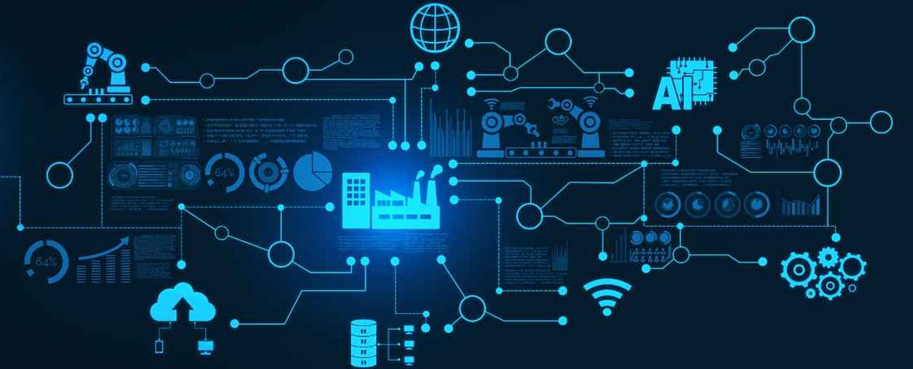
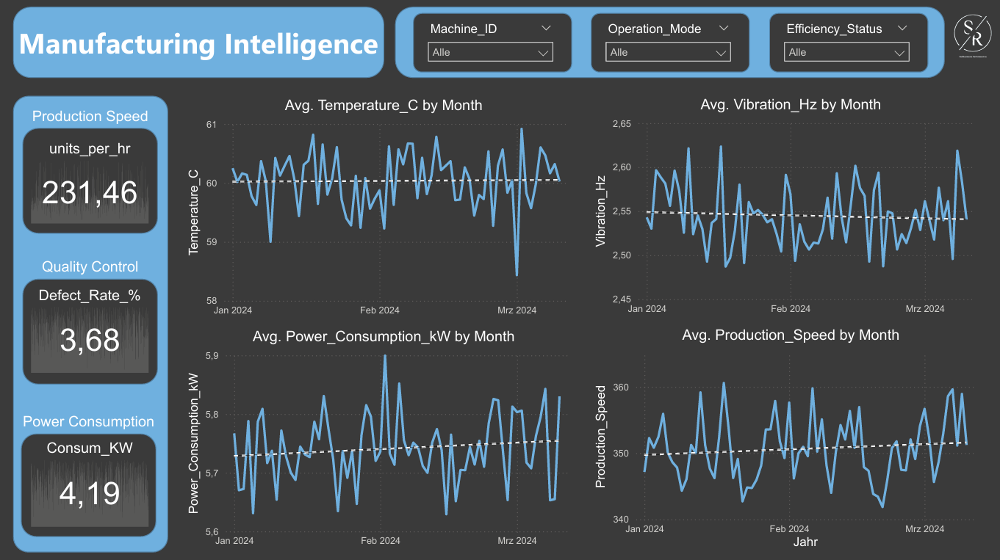
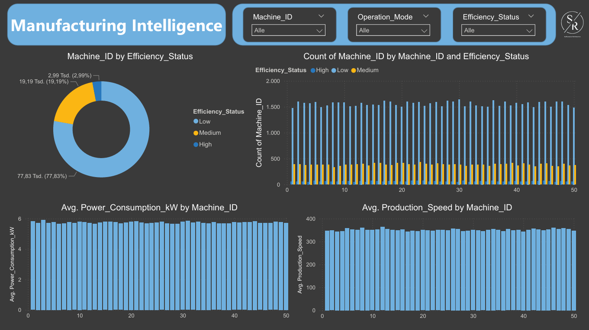
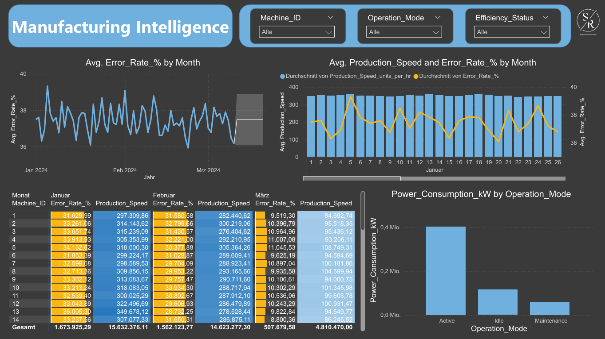

### **1. Project Title**  
**Manufacturing Intelligence Dashboard**  

### **2. Objective or Problem Statement**  
**Objective**:  
To analyze machine performance data and provide actionable insights for improving operational efficiency, monitoring production metrics, and enabling predictive maintenance.  

**Problem Statement**:  
Manufacturing operations often face challenges such as inefficiency in machine utilization, high defect rates, and unplanned downtime. This project aims to address these issues by leveraging data analytics to identify inefficiencies and optimize processes.

### **3. Data Source**  
**Description**:  
Simulated manufacturing data containing machine performance metrics collected over time.  

**Key Variables**:  
- **Machine_ID**: Unique identifier for each machine.  
- **Efficiency_Status**: Categorized as High, Medium, or Low.  
- **Temperature_C & Vibration_Hz**: Environmental factors affecting machine performance.  
- **Power_Consumption_kW & Production_Speed_units_per_hr**: Metrics for energy usage and productivity.  
- **Defect_Rate_% & Predictive_Maintenance_Score**: Indicators of quality control and machine health.

### **4. Tools and Techniques**  
**Tools Used**:  
- Power BI Desktop for interactive dashboards and visualizations.  
- DAX (Data Analysis Expressions) for advanced calculations.  
- Power Query Editor for data cleaning and transformation.

**Techniques**:  
- Time-series analysis to track trends and detect anomalies.  
- Conditional formatting to highlight key metrics (e.g., low efficiency).  
- Aggregations and comparisons to identify underperforming machines.

### **5. Approach**  
#### **Step-by-Step Workflow**:  
1. **Data Cleaning & Transformation**: Imported raw data into Power Query Editor, removed duplicates, handled missing values, and ensured consistency in formats.  
2. **Data Modeling & Relationships**: Established relationships between tables for seamless analysis in Power BI.  
3. **Dashboard Design & Visualization**: Created interactive charts, slicers, and KPIs to visualize key metrics effectively.  
4. **Analysis & Insights Generation**: Used DAX measures to calculate averages, percentages, and trends for actionable insights.

### **6. Key Insights from the Dashboard**
1️⃣ **Efficiency Status Distribution**: 77.83% of machines operate at high efficiency, while 19.19% are medium, and 2.99% are low—highlighting areas for improvement.  

2️⃣ **Machine Performance Analysis**: Machines with higher power consumption were identified for optimization, while production speed variations revealed workload imbalances.  

3️⃣ **Time-Series Trends**: Monthly trends in temperature, vibration, power consumption, and production speed helped detect anomalies early and plan maintenance proactively.

4️⃣ **Defect Rate Monitoring**: A consistently low defect rate (3.68%) indicates effective quality control processes but room for further improvement.

**Page 1**

**Page 2**

**Page 3**

### **7. Impact**
- Enabled real-time monitoring of machine performance with interactive dashboards.
- Identified inefficiencies in energy consumption and production speed.
- Provided actionable insights to support predictive maintenance strategies.
- Improved decision-making by visualizing key metrics like defect rates and efficiency status.

### **8. Challenges Faced**
- Handling missing or inconsistent data during the cleaning process.
- Balancing dashboard complexity with usability to ensure clarity for stakeholders.
- Optimizing DAX measures for performance with large datasets.

### **9. Reflection**
This project reinforced the importance of clean data and effective visualization in driving actionable insights from manufacturing operations. It also highlighted the potential of predictive analytics in reducing downtime and improving overall efficiency.

### **10. Link or Access**

Feel free to explore the project, share your feedback, or suggest improvements! Let's collaborate on building smarter manufacturing solutions together!

